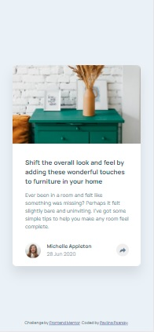

# Frontend Mentor - Article preview component solution

This is a solution to the [Article preview component challenge on Frontend Mentor](https://www.frontendmentor.io/challenges/article-preview-component-dYBN_pYFT). Frontend Mentor challenges help you improve your coding skills by building realistic projects. 

## Table of contents

- [Overview](#overview)
  - [The challenge](#the-challenge)
  - [Screenshot](#screenshot)
  - [Links](#links)
- [My process](#my-process)
  - [Built with](#built-with)
  - [What I learned](#what-i-learned)
  - [Continued development](#continued-development)
  - [Useful resources](#useful-resources)
- [Author](#author)
- [Acknowledgments](#acknowledgments)

## Overview

### The challenge

Users should be able to:

- View the optimal layout for the component depending on their device's screen size
- See the social media share links when they click the share icon

### Screenshot

| Desktop layout |
|:--:|


| Mobile layout |
|:--:|


### Links

- Solution URL: [Add solution URL here](https://your-solution-url.com)
- Live Site URL: [Add live site URL here](https://your-live-site-url.com)

## My process

### Built with

- Semantic HTML5 markup
- CSS custom properties
- Flexbox
- CSS Grid
- Mobile-first workflow
- [React](https://reactjs.org/) - JS library

### What I learned

I learned a lot again. Such a small component, so many topics!

- #### Placing the main image according to design
I decided to place the image as a backround, because it is easier to manipulate it, so it looks like on the design. I don't know how I would accomplish it, if I inserted the image as an html element.
```css
.article-preview__image {
  ...
  background-size: 100%;
  background-position: 50% -1.6rem;
  ...
}

@media (min-width: 50em) {
    .article-preview__image {
      ...
      background-size: 123%;
      background-position: left top;
    }
}
```
Here is the link on MDN: [Background-position](https://developer.mozilla.org/en-US/docs/Web/CSS/background-position)


- #### The share button
I styled the button so it always stays at the top with z-index of 10. The trouble is that if made exactly as per design, either the component's height or the button *jump* when clicked. I chose the button jumping because I had to chose one, but in real life I would talk to the designer, that I am not happy with it this way.

- #### Changing the arrow svg color when active
I did a research on this, changing svg's color seemed quite complicated. But when I opened the file in text editor and saw the fill property I tried to change it with css and it works:
```html
        <svg xmlns="http://www.w3.org/2000/svg" width="15" height="13">
          <path fill="#6E8098" d="M15 6.495L8.766.014V3.88H7.441C3.33 3.88 0 7.039 0 10.936v2.049l.589-.612C2.59 10.294 5.422 9.11 8.39 9.11h.375v3.867L15 6.495z"/>
        </svg>
```
```css
.share-button.active > svg > path {
    fill: var(--clr-light-grayish-blue);
}
```

- #### Social icons
I made the social icons as dummy links in an unordered list. I think this is the correct way. I also added aria-labels because there is nothing to read for screen readers.


- #### It's called a Tooltip!
I watched a few tutorials how to make a tooltip, then I just positioned a div absolutely and turned another 45deg as an arrow with a pseudo-element. It opens and closes with JavaScript.

### Continued development

I didn't include any transitions because I didn't like any I was able to create. I need to account for transitions before styling components and learn more about them. And same for the accessibility features.

### Useful resources

- [CSS Triangles](https://blog.webdevsimplified.com/2020-03/css-triangles/) - Web Dev Simplified Blog
- [How To Make Tooltips With Only CSS](https://youtu.be/ujlpzTyJp-M) - Web Dev Simplified's YouTube tutorial

## Author

- GitHub - [PavlinaPs](https://github.com/PavlinaPs)
- Frontend Mentor - [@PavlinaPs](https://www.frontendmentor.io/profile/PavlinaPs)

## Acknowledgments

It is great that I can solve Frontend Mentor's challenges. They are all very useful for me. And Web Dev Simplified is great too. Thank you!
